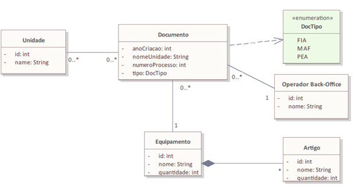
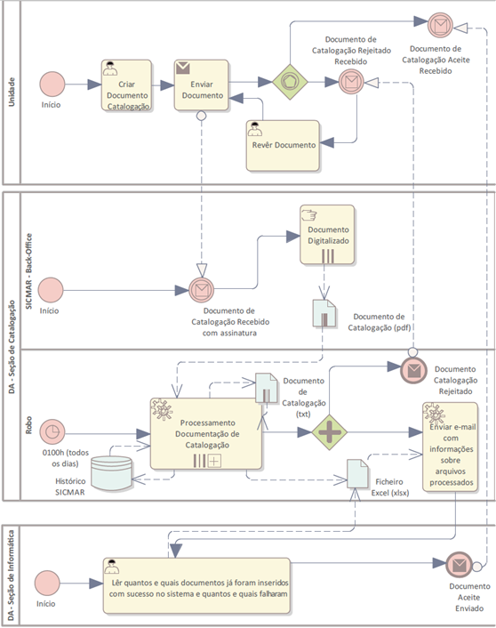
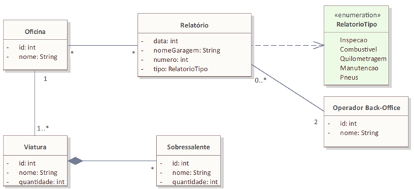
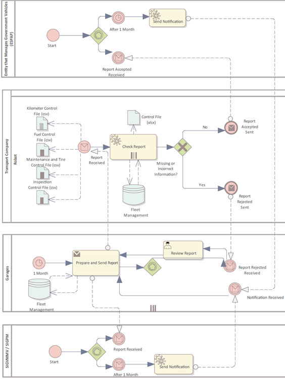

# Trabalho de Aplicação Individual CPOS-M 2022/2023 – 1.ª Edição - Estudo de Estado-Maior
# TEMA: "Escassez de Recursos Humanos na Área do Back-Office e Tecnologias de Informação na Marinha Portuguesa"
# AUTOR: 1TEN EN-AEL Carlos Jorge Martelo Correia 
____________________________________________________________________________________
# Caso de Estudo DA: 

O SICMAR é uma aplicação utilizada para gerir o abastecimento de peças para os navios da MP. 

A criação desta aplicação ocorreu em 2019 com a tarefa principal de catalogar artigos/peças em navios da MP. Os artigos referem-se a peças que equipam os navios da MP. Esta aplicação permite a pesquisa de artigos/peças de três formas diferentes, nomeadamente: ”por pesquisa livre”, “por pesquisa de equipamento” ou “por pesquisa de artigo/peça”. Cada artigo/peça possui informações detalhadas sobre o seu histórico e documentos associados. Salientando-se que todo o histórico dos artigos a partir de 2011 foi carregado na base de dados da aplicação, sendo que a documentação associada estava em suporte digital. 

No entanto, a documentação dos artigos/peças antes de 2011 era manuscrita, de modo que não foi possível ser carregada. Um funcionário administrativo foi responsável pela digitalização de toda essa documentação em falta, aproximadamente 78.000 artigos/documentos de peças, os quais foram fornecidos à equipa do IT para carregamento no sistema. Após dois anos de trabalho diário dedicado a esta tarefa, este funcionário apenas tinha conseguido processar cerca de 10.000 documentos.

### Figura 1 - Robotização Processos DA - Modelo de Domínio. 

### Figura 2 - Robotização de Processos DA – Visão Geral – Diagrama de Colaboração. 

____________________________________________________________________________________
# Caso de Estudo DT: 

A Direção de Transportes possui 60 oficinas, com aproximadamente 300 viaturas. Cada oficina é responsável por reportar (Combustível, Inspeção, Quilometragem, Manutenção e Pneus) mensalmente via e-mail para a equipa de back-office. Esta equipa tem 2 responsáveis pela recolha e processamento dos dados recebidos das oficinas, verificando se todos os relatórios estão corretos dentro dos padrões exigidos pelo Portal SGPVE (https://sgpve.espap.pt/). Em seguida, esta equipa insere estes dados na plataforma (https://sgpve.espap.pt/), caso os ficheiros de relatório sejam carregados para esta plataforma com sucesso, são guardados num ficheiro de controlo (.xlsx). Se o upload não for bem-sucedido, gera uma mensagem de erro na plataforma (https://sgpve.espap.pt/), tendo então a equipa de back-office que copiar a mensagem de erro e enviar um email ao remetente do relatório a solicitar a sua verificação. 

Para além disso, é necessário inserir as mesmas informações, mas em vez de carregar os relatórios, é necessário inserir manualmente os dados da oficina em cada campo do relatório no Sistema de Gestão de Frotas de Viaturas.

O Sistema de Gestão do Parque de Veículos do Estado (SGPVE), de acordo com o Decreto-Lei nº 170/2008 e com a Portaria n.º 382/2009, foi criado com o objetivo de ser um sistema único e integrado que reúne toda a informação da frota do Estado, garantindo os seguintes requisitos:
  i.	  Submissão de pedidos de veículos (aquisição ou atribuição) e atualização mensal de informação relativa aos veículos (quilómetros, manutenções,               sinistros, carregamento automático de ficheiros com consumos de combustível, IPO's);
  ii.	  Controlo (inclui sinistros, manutenção, abates, restituições, afetações, transações efetuadas com o cartão de combustível) da frota própria e da             frota em regime de AOV;
  iii.	Criação, manutenção e alteração de dados mestre de veículos;
  iv.	  Controlo de consumos, emissões de CO2;
  v.	  Reporting de diversos dados relacionados com a frota (manutenções, sinistros, transações de combustível, IPO's, frota ativa e respetivas entradas e           saídas por período) que podem ser obtidos por organismo ou UMC;
  vi.	  Controlo da frota de veículos apreendidos ou perdidos a favor do Estado e considerados "Com Interesse para o PVE".
  
  
### Figura 3 - Robotização Processos DT - Modelo de Domínio. 

### Figura 4 - Robotização de Processos DT – Visão Geral – Diagrama de Colaboração. 

____________________________________________________________________________________
